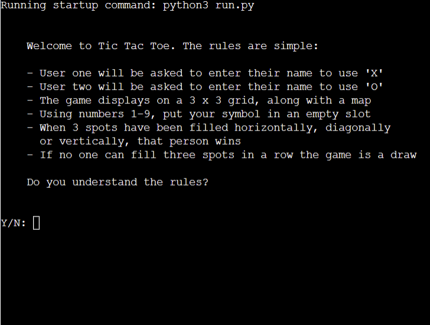
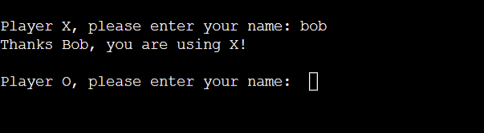
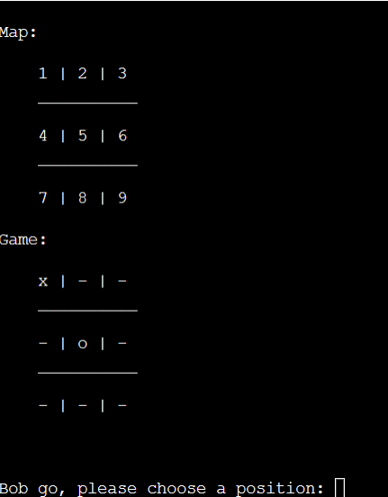

# Tic Tac Toe
## Introduction
Created with Python, Tic tac toe is a two player game where each player takes turns using X or an O. These can go horizontally, diagonally or vertically and are displayed on a grid. The first player to get 3 in a row wins

## User Experience
### User story
As a user, I want to:
- Understand how to play the game
- Have a clear idea of where to put an X or an O
- Be able to play the game again or quit

## Features
### Welcome message

A welcome message is displayed, welcoming the user to the game along with a brief explaination of the rules. The user will then be asked if the understand the rules

### Player Names

After the welcome message the user will be asked to enter a name to play with 'X' and again with 'O'

### Game Play

Once names have been entered for Player X and Player O the game begins. The game is displayed on a 3 x 3 grid. A map will be displayed so the user can see what number correlates to which position on the game board. The user must enter a number between 1-9. If the user tries to enter a number that has already been used they will get an error message.

### End Game

When the game has finished a message saying would you like to play again will display. The user can enter 'y' which will restart the game or 'n' which will exit the game

### Future Features
- Give the option if the user wants to go first or second 
- Add a scoreboard 
- Play online with other people

## Technologies Used
- Python: Programming language
- Github: Version control
- Gitpod: IDE used

## Testing 
### User Stories
As a user, I want to know where to put my symbol:
- This can be done by viewing the map provided 

As a user, I want to be able to see if a spot has already been taken:
- If a spot has already been taken, the user will be shown a message saying that the move is invalid. This will also be displayed if the user enters anyhting other than a number

As a user, I want to be able to play the game again at the end of the game:
- When the user reaches the end of the game they will be shown a message asking them if they want to play again, which the user can input 'y' to play again or 'n' to exit the game

## PEP8
The code was checked with a PEP8 and passed with no errors

## Browers tested in
- Chrome
- Firefox
- Safari
- Mircrosoft Edge

### Python pylint
Currently python pylint is reporting 3 warnings:
- Global variable undefined at the module level: Global statements were used in the game to access global variables. It is not recommened to use global as it can cause issues and the potential for bugs in big programs. For the purpose of a beginner project I found it useful to use them and access them in different places
- Redefining name from outer scope: This passed through PEP8 with no issues

## Fixed Bugs
- Error handling that was stuck in infinite loop. This was fixed by adding booleans and breaks to exit infinite loop
- Trying to stop game when there was a winner. This was fixed by seperating the read input into two different functions
- Reading valid inputs for the game. This was fixed by adding if/else statements that covered every input that wasn't valid

## Deployment 
To deploy on Heroku:
- Navigate to the Heroku dashboard, select 'New' and then click on 'Create new app'
- Write a name for your app and then select your region
- Then click 'Create app'
- Navigate to the settings tab
- Go down to the config vars section and select 'Reveal Config Vars'
- Add in any relevant config vars, in this case 'PORT' was entered in the key field and '8000' in the value field
- Then go to buildpacks and add Python and click save changes
- Then select node.js and click save changes
- Navigate to the deploy tab
- Underneath the deployment method section select GitHub
- Click on 'Connect to GitHub'
- Search for the repository and click connect
- Then go down to the deploy options
- If you want automatic deployment with every new push to the Github repository select automatic deploys
- In manual deploy select what branch to deploy and click 'Deploy Branch'
- Then click on view to see the deployed app

## Clone
The repository can be cloned by following these steps:

- Log into GitHub and go to the GitHub Repository
- Click on the code button on the right above the files list
- Then select HTTPS and copy the URL
- Open Git Bash
- Change the current working to the location you want the cloned directory to be
- Type git clone and paste the URL from earlier
- Press enter to create the local clone

# Credits
- [Clear Screen](https://stackoverflow.com/questions/4810537/how-to-clear-the-screen-in-python)

- [Catch value error](https://stackoverflow.com/questions/58354826/cant-catch-valueerror-in-python)

- [Time sleep](https://www.tutorialspoint.com/python/time_sleep.htm)

- [Print variable in string](https://stackoverflow.com/questions/17153779/how-can-i-print-variable-and-string-on-same-line-in-python)